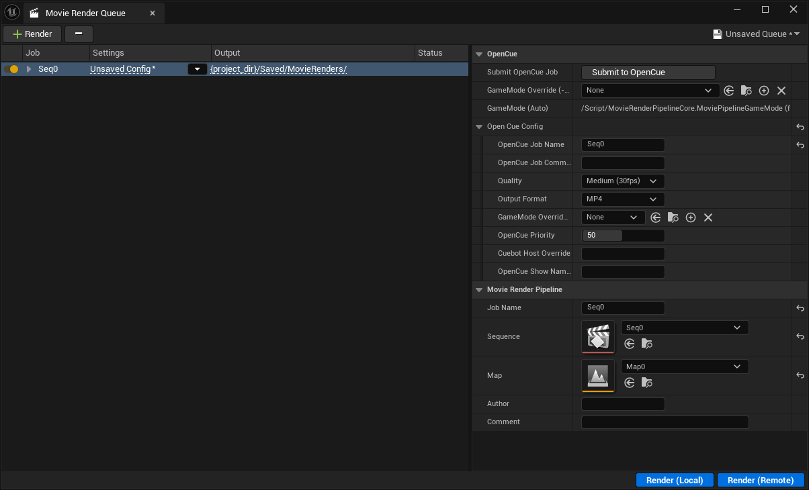

# opencue-ue-services

[](./README.md)
[](./README_CN.md)

用于将 OpenCue 与 Unreal Engine MRQ 集成的 Windows 运行时与工具集。

本仓库提供两个面向产品的可执行程序：
- `opencue-ue-submitter`：提交任务
- `opencue-ue-agent`：执行任务

另外也提供本地 OpenCue 核心服务（`cuebot`、`rqd`、`cuegui`）的便捷启动脚本和打包工具。

## 架构图与时序图

### 提交执行时序


### 系统架构


## 界面截图

### Movie Render Queue - OpenCue 面板


### Project Settings - OpenCue


### CueGUI - Job Queue


### CueGUI - Job Details


### CueGUI - Job Finish


## 组件与职责

| 组件 | 类型 | 职责 | 调用入口 |
| --- | --- | --- | --- |
| `run_cuebot.bat` | 启动脚本 | 启动 Cuebot（Java），并传入 DB 与端口参数 | 开发者 / 本地运维 |
| `run_rqd.bat` | 启动脚本 | 激活 conda 环境并启动 `rqd.exe` | 开发者 / Worker 主机 |
| `run_cuegui.bat` | 启动脚本 | 激活 conda 环境并启动 `cuegui.exe` | 开发者 / TD |
| `opencue-ue-submit.bat` | 包装脚本 | 优先运行 `opencue-ue-submitter.exe`，失败回退 Python | UE 插件或 CLI 用户 |
| `opencue-ue-agent.bat` | 包装脚本 | 优先运行 `opencue-ue-agent.exe`，失败回退 Python | OpenCue 任务命令 |
| `src/ue_submit` | Python 模块 | 解析 `submit_spec.json`，通过 outline/opencue 提交任务 | submitter 可执行程序 |
| `src/ue_agent` | Python 模块 | 以 one-shot 或常驻进程池模式执行 OpenCue 任务 | agent 可执行程序 |
| `build_exes.ps1` / `build_exes.bat` | 构建工具 | 打包 `opencue-ue-submitter.exe` 与 `opencue-ue-agent.exe` | 开发者 / 发布流程 |

## 本地启动流程

前置条件：
- 已安装 UE 插件
- 本仓库已拉到本地
- OpenCue 数据库已完成初始化（schema + seed data）

### 1. 准备 Python/Conda 环境

```powershell
conda create -n opencue_ue python=3.10 -y
conda activate opencue_ue
pip install -r requirements.txt
```

### 2. 启动 OpenCue 核心服务

在 `opencue-ue-services` 下分别打开终端执行：

```bat
run_cuebot.bat
run_rqd.bat
run_cuegui.bat
```

说明：
- Cuebot gRPC 端口为 `8443`。
- `run_cuebot.bat` 默认 HTTP 端口为 `18080`。
- `run_rqd.bat` 会把仓库根目录加入 `PATH`，以便 RQD 能解析 `opencue-ue-agent.bat`。

### 3. 验证 submitter 连通性

```powershell
.\opencue-ue-submit.bat test --host localhost --port 8443
```

预期输出应包含 `"ok": true`。

### 4. 从 UE 插件提交

在 UE 插件提交配置中，提交命令可指向：
- `opencue-ue-submitter.exe`（推荐），或
- `opencue-ue-submit.bat`（包装脚本回退方案）

插件会在 `Saved/` 下生成两个文件：
- `Saved/OpenCueSubmitSpecs/<job_id>_submit_spec.json`
- `Saved/OpenCueRenderPlans/<job_id>.json`

submitter 读取 `--spec`（提交规范），OpenCue worker 再读取 `plan.plan_uri` 指向的 render plan。

## One-shot 执行流程（当前默认）

1. UE 插件写出 `submit_spec.json` 与 `render_plan.json`。
2. UE 调用 `opencue-ue-submitter` 执行 `submit --spec ...`。
3. submitter 创建 OpenCue job/layer，并设置 layer command。
4. RQD 执行 layer command：
   `opencue-ue-agent.bat run-one-shot-plan --plan-path <render_plan_path>`
5. agent 从 `CUE_IFRAME`（回退 `CUE_FRAME`）解析任务索引。
6. agent 启动该任务对应的 `UnrealEditor-Cmd.exe` 并返回退出码。
7. OpenCue 根据进程退出码与任务日志更新 frame 状态。

layer 使用的关键命令：

```bat
opencue-ue-agent.bat run-one-shot-plan --plan-path D:\path\to\render_plan.json
```

## 常驻进程池模式（TODO）

该模式会常驻 UE worker 进程，并通过 HTTP 分发任务。

启动服务：

```powershell
python -m src.ue_agent service --host 0.0.0.0 --port 9100
```

任务桥接命令（切换模式后可作为 layer command）：

```powershell
python -m src.ue_agent run-task --job-id <job_id> --level-sequence <asset_path>
```

## CLI 参考

### Submitter

```powershell
opencue-ue-submit.bat submit --spec D:\path\to\submit_spec.json
opencue-ue-submit.bat test --host localhost --port 8443
```

### Agent

```powershell
opencue-ue-agent.bat run-one-shot-plan --plan-path D:\path\to\render_plan.json
opencue-ue-agent.bat service --host 0.0.0.0 --port 9100
opencue-ue-agent.bat run-task --job-id <job_id> --level-sequence /Game/Seqs/Seq0.Seq0
```

## 日志与运行时数据

默认运行目录（可通过环境变量覆盖）：
- one-shot 日志：`logs/one_shot/`
- 常驻进程池日志：`logs/worker_pool/`
- 进程池数据：`data/worker_pool/`
- 核心服务 pid 文件：`pids/`

常用文件：
- `logs/cuebot.log`
- `logs/rqd.log`
- `logs/rqd_console.log`
- `logs/one_shot/<job_id>/task_<index>.log`
- `logs/one_shot/<job_id>/task_<index>.ue.log`
- `logs/one_shot/<job_id>/task_<index>.runtime.json`

## 构建 Windows 可执行文件

```powershell
.\build_exes.ps1 -Clean -InstallBuildDeps
```

或：

```bat
build_exes.bat -Clean -InstallBuildDeps
```

输出产物：
- `dist/opencue-ue-agent.exe`
- `dist/opencue-ue-submitter.exe`

包装脚本查找顺序（`opencue-ue-agent.bat` / `opencue-ue-submit.bat`）：
1. bat 同目录下的 exe
2. `dist/` 下的 exe
3. 回退到 `python -m src.ue_agent` 或 `python -m src.ue_submit`

## 冒烟测试清单

1. `.\opencue-ue-submit.bat --help`
2. `.\opencue-ue-agent.bat --help`
3. `.\opencue-ue-submit.bat test --host localhost --port 8443`
4. 在 UE 中提交一个任务
5. 在 CueGUI 中确认任务启动，并检查 `logs/one_shot/<job_id>/` 日志

## 可安全清理（可再生文件）

可以安全删除以下本地运行/构建产物：
- `build/`
- `logs/`
- `pids/`
- `src/**/__pycache__/`
- `.env`（若你打算从 `.env.example` 重新生成）

除非你明确要重新配置，否则不要删除：
- `Downloads/cuebot-1.13.8-all.jar`
- `Downloads/schema-1.13.8.sql`
- `Downloads/seed_data-1.13.8.sql`

## 相关仓库

- `OpenCueForUnreal_Plugin`（UE 插件）
- `OpenCueForMRQ_Demo`（演示项目）
